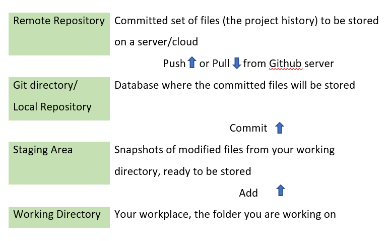

```{r setup, include=FALSE}
knitr::opts_chunk$set(echo = FALSE, warning = FALSE, message = FALSE, fig.path = "Report_files/")
```


```{css, echo=FALSE}

# Config CSS for the report
#header {
  border-left: 3px solid #486370;
  padding-left: 10px;
}
h1 {
  color: #486370;
  font-weight: 500;
  border-left: 3px solid #486370;
  padding-left: 10px;
  margin-top: 20px;
}
#header h1 {
  border: none;
  padding-left: 0;
}
h2 {
  color: #512D6D;
  font-weight: 600;
}
h3 {
  color: #512D6D;
  font-style: italic;
  font-weight: 600;
}
h4 {
  color: #512D6D;
  font-weight: 600;
}

h5 {
  color: #512D6D;
}

```

```{r}
library(tidyverse)
library(tidymodels)
library(naniar)
library(patchwork)
library(wordcloud2)
library(gutenbergr)
library(tidytext)
library(tm)
library(kableExtra)
```


# Introduction

## Background

From 8 September to 2 November 2021, the author worked on the **Monash University's Data Science: Data-Driven Decision Making** micro-credential on FutureLearn, under the supervision of Rowan Peter from the host organisation (Monash Centre for Professional Development and Monash Online Education, informally referred to as the Centre).


Offered by the Monash School of Business and led by Professor Dianne Cook, the Data Science: Data-Driven Decision Making is an online postgraduate micro-credential program comprising three courses at Level 8 of the Australian Qualifications Framework. The micro-credential guide learners through practical programming exercises in R language to learn the process of tidying, harvesting and wrangling data and applying statistical models to simulate complex functions that solve a broad range of problems.

## Motivation

By the end of November 2021, the course will finish its fourth run. Overall, it went smoothly and was generally well-received by the learners. However, While the course is masterfully crafted, most of it was written 2 years ago. There is a need to update some of the materials that were outdated or no longer relevant. Furthermore, there are gaps in the existing resource that can be further enhanced to deliver a smoother learning experience for the learners, especially those without statistics or coding backgrounds. 

Based on those reasons, the author reviews the materials and objects that have already been created, identify areas for enhancement and gaps, and then create the assets to fill those gaps, all within the scope of the micro-credential. 

The assets the author created include written types (code chunks and worked examples) and media types (Tutorial with screen recording).

## Objectives

Because of the nature of the internship (creating enhancements for an existing micro-credential), assets created vary greatly in content, goals and difficulty. However, every asset needs to satisfy the common objectives: It must relate to the concepts and learning outcomes of its respective course.

Each course will also satisfy different objectives, depending on the nature of the material.  

### Common objectives 
The assets were crafted with the nature of micro-credential in mind. All the assets are related to the concepts and learning outcomes of their respective course. Furthermore, The assets need to maximise user experiences. In detail, the "difficulty" of the assets is modified depending on the nature of the course. For example, assets in the first course use simpler words, together with very detailed explanations and comments that can be lengthy to some learners. Those assets also don't include new concepts that were not introduced in the material.  In courses 2 and 3, explanations and comments are more concise. Academic words are used more frequently in those courses. New concepts are introduced when needed (e.g: Using package patchwork to combine graphs). 

### Specific objectives

Given the wide variety in contents of each asset, an one-size-fits-all objective may not be suitable. A range of specific objectives is created to assess each enhancement created. All assets have an aim to satisfy as many specific objectives as possible. Overall, the specific objectives aim to maximise learners' studying experience and to provide knowledge that can be applied in future real-life cases that the learners will eventually face.

Detailed information of specific objectives are as follow:

1. Creating well-documented and well-explained assets that support new learners with no background in statistics and R-coding. 

2. Delivering cutting edges techniques that learners can apply in solving problems. 

3. Providing detailed examples and code that learners can duplicate in their work. 

4. Supplying functional practices that can improve learners' productivity.

## Contribution

Based on recommendations and feedback from the micro-credential course team and learners, the author crafted enhancements that fill the gap in pre-existing material, thus improving the value of the micro-credential. Furthermore, the author wrote the assets with the learner's studying in mind and compared that with his own personal experience in learning R to deliver unique written and media materials. These are valuable properties for the course that will assist learners in gaining the skills that they need to apply for roles like data scientist or use the knowledge gained to enhance their current organisation.


## Methodology
The assets created in the internship are based on the tidyverse approach. All of the new material utilised already-in-use datasets, creating a smooth transition between old and new sessions. As each asset focuses on a different part of the course, further information is provided in the corresponding section.

## Limitations
The assets and enhancements created in this have a number of limitations:

1. Since the 4th run of the micro-credential online course is still in process. The course will finish in early December, which means that by the end of the internship, the material can not be applied immediately. This may prove troublesome, as the author may not be available in the time period when the changes occur and helps are needed.

2. Given the nature of micro-credential online course, feedback on the material will not come until June, 2022. This make improving the assets any further can be a problem as the author is not employed to work in that time period. 

# Assets developed for the internship:

Based on the analysis of existing materials, recommendations and feedback from the micro-credential course team (Professor Cook, Jiaying Wu and Rowan Peter) as well as documented learner anecdotes), the author has designed and developed the following new enhancements (assets): 

## Asset 1: Functions (Written + Tutorial)

In the first course, Wrangling and Workflow, of the micro-credential, the material teaches the learners to use functions to solve statistical problems. However, the author believes this approach is not suitable. Many learners don't have a background in statistics or math, so they are not interested in using functions in this fashion. Furthermore, various pre-written packages also supply a wide range of functions for this purpose.  

Another way of using functions, as tools to avoid repetition, should be taught. The learners can apply the knowledge immediately to improve their productivity. Therefore, the author created a new section to teach the learners about function as a tool to automate common tasks. The author also provided a tutorial for this asset.

### Asset summary
Dataset: [Tuberculosis dataset](https://github.com/datascienceprogram/ids_course_data/blob/master/tb_tidy.rds) from the previous part of the course. 

Specific objectives satisfied: Objectives 1, 2, 3 and 4. 

#### Key contributions:
1. Provide reasons to apply function as a tool to automate common tasks.    
2. Teach learners how to write functions and examples.  
3. Introduce curly curly "{{ }}" to combine tidyverse wrangling verbs and function.   
4. Provide tutorial video with screen recording.

### The asset in detail: 
#### Why should you use function?
Functions are powerful ways to automate your tasks. You will become more productive using function.  

1. Function enable easy reuse within a project, helping you not to repeat yourself. Use function whenever there is a need to copy and paste a block of code more than twice.  
2. Function eliminates the chance of making incidental mistakes when you copy and paste (i.e. updating variable names in several places).   
3. Function can be given an evocative name that makes your code easier to understand.  
4. Function will help you to effortlessly update your code as requirements change.  

```{r}
tb_long <- readRDS("data/tb_long.rds")
```

```{r example, eval = FALSE}
# Do you see any problems in this code chunk?
# Too much repetition?
tb_long %>% filter(country == "Australia") %>%
  ggplot(aes(x = year, y = count))+
  geom_col()


tb_long %>% filter(country == "Brazil") %>%
  ggplot(aes(x = year, y = count))+
  geom_col()


tb_long %>% filter(country == "China") %>%
  ggplot(aes(x = year, y = count))+
  geom_col()

```

#### How to write function:

1. Pick a short but informative name, preferably a verb.  
2. List inputs, or arguments, inside the round brackets inside function. If we had more the call would look like function(x, y, z).    
3. Place the code you have developed in body of the function, a {} block that immediately follows function(...).    

Note that, is is easier to start with working code and turn it into a function; it’s harder to create a function and then try to make it work.


Example:

```{r echo = TRUE}
# Function to make a bar chart to see the number of cases of tuberculosis across years for a specific country.
# Identify inputs: data and a country name.
# First argument (x) is data
# Second argument (y) is the country we want to draw the graph for (Must be inside double quotation mark)

# Make our function easier to read
# And change the color
plot_a_country <- function(data, country_name){
  # Filter the country
  plot_dat <- data %>% filter(country == country_name)
  # Draw the plot
  plot <- plot_dat %>% 
    ggplot(aes(x = year, y = count))+
    geom_col(fill = "steelblue")
  
  return(plot)

}
# Checking the function
# The function works as "United States of America" is a valid country name.
plot_a_country(tb_long, "United States of America") 

# You can further modify the plot after using the function
plot_a_country(tb_long, "United States of America") +
  theme_bw()+
  ggtitle("USA tuberculosis by year")
```


#### About curly curly {{}} 

It was hard to write function with tidyverse wrangling verbs. R will throw all type of error at you. You couldn't easily use select(), summarise(), group_by() inside a function. Curly curly helps with that. It work *within* the function.

When you create a function using select(), summarise(), group_by(), wrap the function arguments containing data frame variables with {{.

Examples:

```{r echo =TRUE}

# You can not run this function if you remove the curly curly

# Function to find the total cases by country since first recorded
 
total_by <- function(data, var, by) {
  data %>%
    group_by({{by}}) %>%
    summarise(total_cases = sum({{var}}, na.rm = TRUE)) %>%
    arrange(desc(total_cases))
}

# Checking the function
total_by(tb_long,count, country) %>% head(10) %>% 
  kable(caption = "Top 10 countries with highest total cases of tuberculosis since first recorded") %>% 
  kable_styling(bootstrap_options = c("striped", "hover", "condensed")) %>%
  scroll_box(height = "300px")

```

## Asset 2: Base R, R Operators, Syntax, Shortcuts. Introduce to knitr chunk options (Written)

There is a gap in the existing material: The use of Operators, Syntax, Shortcuts and knitr chunk options are not mentioned in the course. In the author's belief, they are useful resources that can improve productivity. Therefore, the author created this asset as a "further reading" section, especially for new learners that have no knowledge in R. It is a collection of shortcuts, syntax and operators that the author found handy. It will act as a "cheat sheet" that the learners can come back and read again from time to time. This "cheat sheet" saved the author a large amount of time and make him more productive. It also makes coding with R smoother. In composing this part, the author hopes that the learners can apply the knowledge here in their future works and projects. 

For the base R syntax, they confused me when the author first learned them. Since they are all over StackOverflow and the internet, the learners will stumble on them sooner or later. They are old and not used much, and thus are not taught in the course. However, the author figured that knowing the basics of base R may help the learners with their learning and handling assignments, and eventually to solve real-life problems that they will face in the future.


### Asset summary
Data: No data was used.
Objective satisfied: Objective 1, 3 and 4.

#### Key contributions
1. Provide tables for operators, syntax and shortcuts that help learners in improving their productivity.
2. Introduce learners to base R syntax.
3. Introduce learners to chunk's options in knitr and Rmarkdown.

### The asset in detail
The asset contains a large amount of text and tables, which may interrupt the overall flow of the report. Furthermore, it is nearly impossible to fit in this section as the asset contains an extensive number of headings. See Appendix 1 for more detail of the asset. 

## Asset 3: Git and GitHub functionality (Tutorial)

In course 1, there is material about setting up Git and GitHub version control in RStudio. However, there is no material to instruct learners what to do after that, i.e how to use Git and Github studio terminal in R. This created a gap that needs to be fulfilled.

### Asset summary
Data: No data used
Objective satisfied: Objective 3.

#### Key contributions

1. Introduce learners to Git and Github workflow
2. Introduce learners to git commands to interact with GitHub using the Terminal:

### The asset in detail

#### Git and Github Workflow
```{r github, fig.cap = "Git and Github version control system", out.height= "75%", out.width= "75%"}

```
Figure \@ref(fig:github) shows the three-states system of Git with the addition of the remote repository from Github. 

#### List of Git commands
• git pull (Download content from a remote repository and immediately update the local repository to match that content).    
• git status (The git status command displays the state of the working directory and the staging area).    
• git add file_name  (Add a change in the working directory to the staging area, you need to specify the file).    
• git add . (Add all changes in the working directory to the staging area. Be careful with it.).  
• git commit -m “Message” (m = message for commit. The git commit is used to create a snapshot of the staged changes along a timeline of a Git projects history).  
• git push origin (push/ upload the local repository content to a remote repository).  

## Asset 4: Sample assignment (Written)

My supervisor, Rowan Peter, suggested that an example for the first assignment of the micro-credential is needed, as the works that learners suggest varied largely in contents, methods and quality. Furthermore, an example that acts as an exemplar for learners is desired, as this may help to guide them in further projects. The example also introduces learners to a standard report, which need to have a logical flow and graphs with proper title and labels.

The sample assignment can be of great use for learners. Not only does it act as an example for their work, it also provides good practices to the learners. An example is to provide appropriately labelled visualisation. Another example is the practice of cleaning and checking the data before any analysis and reporting only interesting results/ findings.  

Because the asset belongs to course 1, Wrangling and Workflow, only basic wranglings and visualising techniques are used to create the example. More advanced techniques are not used. For example: dealing with missing values, fitting modelling techniques or the use of statistical and machine-learning tools.
### Asset summary
Dataset: The data is originally observed from the Coffee Quality Institute website and was scraped by @James2018, the data was then re-posted on [Kaggle](https://www.kaggle.com/volpatto/coffee-quality-database-from-cqi?select=merged_data_cleaned.csv).

Specific objectives satisfied: Objectives 1, 2, 3 and 4. 

#### Key contributions

1. Provide assignment examples with a nice flow and well-structured sections.
2. Provide code chunks that only use functions and knowledge covered by the first course.
3. Provide well-documented code, and have high production values. The code can be re-used or duplicated in later projects. 

#### The asset in detail

As the asset has its structure, including it in this section will heavily disrupt the flow of the report. Therefore, the asset is put in Appendix 2. 


## Asset 5: KNN imputation and survivorship bias  (Written)

In Course 2, Modelling and Visualisation, learners are introduced to missing values. Two gaps need improvement in this course:

Firstly, the introduction is neither informative nor engaging Moreover, many explanations are vague and use words that are different from previous parts ("Cases" instead of "Observations"), which negatively affects the learner's experience. 

Secondly, many learners struggled with neighbour imputation implementation on Step 1.16. "Dealing with missing data". The "bioconductor" package used in the section is outdated and hard to install. Furthermore, the material of this part is not documented, making it hard to understand.  

### Asset summary
Dataset: oceanbuoys from package @naniar.  
Objective 1, 2, 3 and 4

#### Key contributions:

1. Highlight the problems of missing values in real life, with survivorship bias and the Challenger disaster as examples.   
2. Replace the old knn_imputation method with a more advanced tidymodels approach.  
3. Provide a better explanation and more documents for code chunks, provide discussion for KNN- imputation result.   
4. Rewrite parts of the existing materials, uniform the use of terms and add a comparison of imputation methods to improve user experience.

### Comparision old material and new material
Old code has several problems:

- Very hard to install the package.
- The package is outdated.
- Very hard to understand the codes since there are no comments, no result and no discussion.
```{r eval = FALSE, echo = TRUE}
# old code

# Very hard to install the package
 if (!requireNamespace("BiocManager", quietly = TRUE))
    install.packages("BiocManager")
 BiocManager::install("impute", version = "3.10")
 
 
# No comments whatsoever
# Very hard to follow 
library(impute)
tao_impute <- bind_shadow(oceanbuoys) %>%
  arrange(year, sea_temp_c, air_temp_c) %>%
  select(sea_temp_c, air_temp_c) 
tao_impute <- impute.knn(as.matrix(tao_impute), 5)
tao_shadow <- bind_shadow(oceanbuoys) %>%
  arrange(year, sea_temp_c, air_temp_c) %>%
  mutate(sea_temp_c = tao_impute$data[,1],
         air_temp_c = tao_impute$data[,2])
ggplot(tao_shadow,
       aes(x = sea_temp_c,
           y = air_temp_c, 
           colour=air_temp_c_NA)) +
  geom_point(alpha=0.7) + 
  facet_wrap(~year) + 
  scale_colour_brewer(palette="Dark2") +
  theme(aspect.ratio=1)

```

New Code:
- Using tidymodels package which is more advanced and esier to install.
- There are comments and discussion of results, making the code easier to understand and improve learner's experience.
```{r include = FALSE}
# Code to make the mean impute plot
tao_shadow <- bind_shadow(oceanbuoys)
tao_shadow <- tao_shadow %>%
  group_by(year) %>%
  impute_mean_at(vars(sea_temp_c,
                      air_temp_c)) %>%
  ungroup()

mean_impute_plot <- ggplot(tao_shadow,
       aes(x = sea_temp_c,
           y = air_temp_c, 
           colour=air_temp_c_NA)) +
  geom_point(alpha=0.5) + 
  facet_wrap(~year) + 
  scale_colour_brewer(palette="Dark2")+  
  ## Add a tag and label for both axis
  labs(tag = "Mean Imputation")+
  xlab("Sea Temperature (C)")+
  ylab("Air Temperature (C)")

```


```{r imputation, echo = TRUE, fig.cap = "Mean Imputation VS KNN Imputation"}
# New code

# Install and load tidymodels
# install.packages("tidymodels")
library(tidymodels)

tao_shadow <- bind_shadow(oceanbuoys)
impute_rec  <- tao_shadow %>%
  # In recipe, choose the variable that we will use. In this case:
  # year, sea_temp_c, air_temp_c, air_temp_c_NA
  recipe(year~ sea_temp_c+air_temp_c+air_temp_c_NA) %>%
  # Impute the missing values with all predictors
  step_impute_knn(sea_temp_c,air_temp_c) 


# get the imputed data out using juice()
# You can use bake() to apply the recipe to other dataset. (Eg. New dataset) 
imputed <- prep(impute_rec) %>% juice() %>%
  mutate(id = row_number())

## Draw the plot
knn_impute_plot <- ggplot(imputed,
       aes(x = sea_temp_c,
           y = air_temp_c, 
           colour=air_temp_c_NA,
           group = id)) +
  geom_point(alpha=0.5) + 
  facet_wrap(~year) + 
  scale_colour_brewer(palette="Dark2")+
    ## Add a tag and label for both axis
  labs(tag = "KNN Imputation")+
  xlab("Sea Temperature (C)")+
  ylab("Air Temperature (C)")

# Compare 2 methods of imputation using patchwork package
#Install patchwork
# Install.packages("patchwork")

## Patchwork allows us to combine ggplots into 1 graphic.
library(patchwork)

# Display both graphs 
mean_impute_plot / knn_impute_plot

```


The imputed values are **closer** to the complete case values in both methods. However, for the mean imputation method, the data points form a rigid line, mismatching the variation. They also extend outside the range of complete values. For the KNN method, the values blended well with the complete values. There is still a rigid line that extends outside of the range of complete values in KNN imputation. This can happen if all of the points missing on air temp (ones with high values on sea temp) have the exact same nearest neighbours. If we increase k, to add more nearest neighbours, eventually the line should break. However, there are multiple missings at extremes of sea temp so the line is probably as good as can be done by nearest neighbours.

There is a problem: the imputed air temperature value for these high sea temperature cases is **lower** than expected for both mean imputation and KNN imputation. There is also an outlier in 1993 for KNN imputation. It is suspected that this point should be a 1997 record and there has to be an error in the data. These findings may possibly impede good model fitting.

## Asset 6: Wordcloud (Written)  

In course 3, learners are taught how to visualise text data using ggplot and geom_points. However, there is another approach in visualising text data that is not mentioned. Therefore, the author created this section about using word clouds to visualise text data. Word clouds are very useful as they provide a simple and clear presentation of text data, presenting frequently used keywords bigger and bolder than the rest. As such, they are very easy and quick to understand. Furthermore, word clouds are visually engaging, which allow us to draw multiple insights quickly and allow us flexibility in interpretation.


Dataset: Text data from "On the Origin of Species", 1st edition (Charles Darwin) from package gutenbergr

Objective satisfied: Objective 1, 3 and 4.

#### Key contribution: 
1. Introduce learners to 2 ways of drawing word cloud in R.
2. Provide codes, comments and discussion for graphs created. 

#### The asset in detail: 

```{r include = FALSE}
# Prepare the data
# Already presented in the course
darwin1 <- gutenberg_download(1228)[-(1:9),]
darwin1$text <- removeNumbers(darwin1$text)

darwin1_words <- darwin1 %>% 
  unnest_tokens(word, text) %>%
  anti_join(stop_words, by = "word") %>%
  count(word, sort = TRUE) %>%
  mutate(len = str_length(word))  %>%
  filter(!grepl("\\d", word))  
```

```{r wordcloud1, fig.cap="Word cloud of On the Origin of Species, 1st Edition using wordcloud function", echo = TRUE}
# Word cloud using the package wordcloud. 
# Make a temporary dataframe, since wordcloud require only 2 columns which are word and freq.
# There are many useful arguments to toggle, try to explore them.
library(wordcloud)
temp <- data.frame(word = darwin1_words$word, n = darwin1_words$n)

# Use wordcloud
wordcloud(words = darwin1_words$word, 
          freq = darwin1_words$n,
          min.freq = 100, max.words=200, 
          random.order=FALSE, rot.per=0.35,
          colors=brewer.pal(8, "Dark2"))
```


```{r wordcloud2, fig.cap="Word cloud of On the Origin of Species, 1st Edition, using wordcloud2 function", echo = TRUE}
# Assets on creating word cloud 

# Wordcloud 2 produce HTML output, suitable when you need to knit your report to html

# Make a temporary dataframe, since wordcloud require only 2 columns which are word and freq.
# Then get the words that appeared more than 100 times
temp <- data.frame(word = darwin1_words$word, n = darwin1_words$n) %>%
 filter(n > 100) 

# Use wordcloud2
# Try to change the shape of the cloud. Hint: shape in ?wordcloud2

wordcloud2(temp, size = 0.5, shape = 'star', color = "random-dark")


```


From both word clouds (Figure \@ref(fig:wordcloud1) and Figure \@ref(fig:wordcloud2), we can see that "species" appeared the most frequently. It was used far more often than other common words, such as varieties, selection, forms, ... It seems like the book focus mostly on the natural world and the variation and selection of species. There seems to be a large focus on plants, and a smaller focus on animals such as birds and insects. It is interesting to note that the words related to geology, such as "land", "water" and "sea" did not appear much. Besides, it is a surprise that "genetic", a very important field of evolution theory, did not even appear on the word cloud.  

# Conclusion
In conclusion, all of the assets created by the author satisfied the pre-identified common objectives and specific objectives. The material follows strictly the goals of micro-credential: To assist learners in gaining the skills that they need to apply for roles as a data scientist or use the knowledge gained to enhance their current organisation. The author combines his own experience in learning R and a focus on learners' studying experience to deliver unique written and media materials. These materials are valuable properties for the course that will improve the quality of teaching and the learner's studying experience.

# Appendix

## Appendix 1: Asset 2: Shortcuts, Syntax and Operator 

The author create this asset as a "further reading" section, especially for new learners that have no knowledge in R. It is a collection of shortcuts, syntax and operators that the author found handy. It can act as a "cheat sheet" that you can comeback and read again from time to time. This "cheat sheet" saved me large amount of time and make me more productive. It also makes coding with R smoother. In composing this part, the author hope that you can apply the knowledge in here in your future works and projects. 

For the Operator part, you will remember them in no time, so the author leave it here just in case you need a quick reminder.

For the base R syntax, they confused me when the author first learned them. Since they are all over StackOverflow and the internet, you will stumble on them sooner or later. They are old and not used much, and thus are not taught in the course. However, the author figured that knowing the basics of base R may help you with your learning or handling assignments, and solving real-life problems that you will face in the future.  


###  Shortcuts
Some useful shortcuts in R that will save you time.
See more in [here](https://support.rstudio.com/hc/en-us/articles/200711853-Keyboard-Shortcuts) (or press Alt+Shift+K/ Option+Shift+K)

| Description                      | Windows & Linux |       Mac      | Notes                       |   
|----------------------------------|-----------------|----------------|-----------------------------|
| Left assignment                  | Alt+ -          | Option+ -      | Shortcut for  "<-"          | 
| Undo                             | Ctrl+Z          | Cmd+Z          |                             |   
| Redo                             | Ctrl+Shift+Z    | Cmd+Shift+Z    | Not Ctrl + Y.               |   
| Insert pipe operator             | Ctrl+Shift+M    | Cmd+Shift+M    | Shortcut for pipe (%>%)     |   
| Comment/uncomment lines          | Ctrl+Shift+C    | Cmd+Shift+C    | Add # to the start of lines |   
| Move cursor to Source Editor     | Ctrl+1          | Cmd+1          | Move your cursor to Source Editor (Rscript, Rmarkdown)                 |   
| Move cursor to Console           | Ctrl+2          | Cmd+2          | Move your cursor to Console                  |   
| Save active document             | Ctrl+S          | Cmd+S          | Essenstial Shortcut         | 
| Show Keyboard Shortcut Reference | Alt+Shift+K     | Option+Shift+K |                             |  
| Insert chunk                     | Ctrl+Alt+I      | Cmd+Option+I   | Useful                      | 


### Operator & Math Function

| Operator | Description              |
|----------|--------------------------|
| <=       | Less than or equal to    |
| >=       | Greater than or equal to |
| ==       | Equal to                 |
| !=       | Not equal to             |
| `<-`     | Leftward Assignment      |
| `->`     | Rightward Assignment     |
| !        | Negation                 |
| `x | y`  | X or Y                     |
| `x & y`  | X and Y                    |
| %in%     | Element in a set. If you are making multiple comparisons use %in% rather than ==.    |

### Math Function

|Operator     |Description                 | Operator | Description  |
|-------------|----------------------------|------------|------------------------------------|
| round(x, n) | Round to n decimal places. | sum(x)     | Sum                                |
| log(x)      | Natural log                | mean(x)    | Mean                               |
| exp(x)      | Exponential of x           | median(x)  | Median                             |
| sqrt(x)     | Square root of x           | max(x)     | Max                                |
| abs(x)      | absolute value of x        | min(x)     | Min                                |


The %in% operator in R can be used to identify if an element (e.g., a number) belongs to a vector or dataframe.
Example: `filter(tb_long, iso3 %in% c("AUS", "NZL", "IDN"))`.
`
For select, you can drop variables by prefixing the name with -.
Example: `select(tblong, -count)`


### Base R operator
Have you ever wonder that before Tidyverse, how do people "select" or "filter" ? Back in those days, people used base R. This section introduce two most often used base R syntax: the dollar sign `$` operator and Square Brackets []

#### The `$` sign
The dollar sign `$` operator can be used to select a variable/column, assign new values to a variable/column, or add a new variable/column in an R object. It is still useful when using with unique() and distinct(). 
Example:

```{r echo = TRUE}

# Create my own dataframe: 
stream_service <- data.frame(
 ID = c(1:3),
 service_name = c("Netflix", "Disney+", "HBO"),
 service_price = c(28, 19, 25)
)
# Select the service_name columns:
stream_service$service_name

# Make new columns for shows
stream_service$shows <- c("Squid Game", "Loki", "Friends")

# Make new columns for price, because we have a 30% discount for every service:
stream_service$discount <- stream_service$service_price*0.8
print(stream_service)


```

#### The Square Brackets `[]`
Square Brackets [] allows you to **Extract** elements from data. It is easier to understand [] with example:

| Syntax   | Description                             |
|----------|-----------------------------------------|
| [2, ]    | Select row 2                            |
| [ , 1]   | Select column 1                         |
| [1, 2]   | Select an element (row 2, column 1)     |
| [1, 1:5] | Select first column, from column 1 to 5 |

Examples:

```{r}
# Example
stream_service[1,2]
stream_service[, 1]
stream_service[2, ]
stream_service[1, 2:3]
```

## Tips on Rmarkdown


See the [R Markdown Reference Guide](https://www.rstudio.com/wp-content/uploads/2015/03/rmarkdown-reference.pdf) for a complete list of knitr chunk options.

| Option                | Description                                                                            |
|-----------------------|----------------------------------------------------------------------------------------|
| {r chunkname}         | Set chunkname>. Debugging is easier with this. Try to avoid spaces, periods (.), and underscores (_). Use hyphen(-) instead. Eg, my-codechunk is a good label while my.codechunk or chunk 1 are bad|
| eval = FALSE          | Do not run the code in the codechunk.                                                  |
| echo = FALSE          | Run the chunk, display only results (and not the code) in knitted file.                |
| message = FALSE       | Prevent any message to appear in the knitted file. Eg. Message from ggplot2            |
| warning = FALSE       | Prevent any warning to appear in thr knitted file. Eg. Warning from library(tidyverse) |
| include = FALSE       | Run the chunk. Nothing from the code chunk will appear in the knitted file.            |
| results = 'hide'      | Hide the results of the chunk.                                                         |
| fig.cap = "..."       | Adds a caption to graphical results                                                    |
| fig.width, fig.height | Set the figure width and height (in inches) Eg. ```{r, fig.width=4, fig.height=6}      |


Example: ```{r, my-code-chunk, echo = FALSE, message = FALSE, warning = FALSE, fig.width = 6, fig.height = 4, fig.cap = "This is a figure caption"}
You may use knitr::opts_chunk$set() to change the default values of chunk options in a document. 

It is good practice to include every package you use at the setup code chunk (the first codechunk when you create a new Rmd file). Or put them in a code chunk at the top of the Rmd file.
Example: 
```{r library, echo = TRUE, warning=FALSE, message = FALSE}
library(tidyverse)
library(ggplot2)
library(dplyr)
library(tibble)
library(tidyr)
library(readr)
library(stringr)
library(readxl)
```

## Appendix 2: Example Assignment


Note from the author:  
- This is just a suggestion, not a guide. How to do the assignment is purely depend on you.    
- If you can see the knitted HTML version, there is a small box on the upper right of the page that says `Code`. Click on it to show/ hide all the code. 
- It is recommended that you appropriately labelled your visualisation by adding graph title and axis labels for ggplot objects.  
- Again, this is just a suggestion, not a guide. Do the assignment in the way that works best for you.    

### Introduction (Optional)

People drink coffee for various reasons: either to warm their soul in a chilling morning or to stay awake and focus after a long, restless night. Whatever the reason is, it is clear that we love the dark, fragrance liquid. Some people love coffee for its pleasant aroma. Some others love its unique flavour notes. Some simply love it because it is as black as their soul. But most would agree that nothing is better than a cup of great coffee to start a wonderful, productive day.
 
Great coffee beans produce great coffee cups. The question is, what do we, coffee lovers, should consider when planning to buy a premium bag of charming black beans?  Hence, in this report. We will have a journey to the place where the coffee trees were raised and the beans were harvested, to see what affects the quality of our beloved coffee.


### Data description
#### Data source
The Coffee Quality Institute is a non-profit organization that grades coffee samples from around the world in a consistently and professionally manner.

The coffee beans are graded by the Coffee Quality Institute's trained reviewers. The total rating of a coffee bean is a cumulative sum of 10 individual quality measures: aroma, flavor, aftertaste, acidity, body, balance, uniformity, clean cup, sweetness and cupper points. Each grade is on a 0–10 scale resulting in a total cupping score between zero and one hundred. [@coffeegrade2020] 

#### About the dataset
The data is originally observed from the Coffee Quality Institute website and was scraped by @James2018, the data was then re-posted on [Kaggle](https://www.kaggle.com/volpatto/coffee-quality-database-from-cqi?select=merged_data_cleaned.csv) (Yes, this dataset is from Kaggle. And no, you are not allowed to use data from Kaggle). Furthermore, @Mock2020 did the initial cleaning for the scraped data. 
## Data source
The Coffee Quality Institute is a non-profit organization that grades coffee samples from around the world in a consistent and professional manner.

The coffee beans are graded by the Coffee Quality Institute's trained reviewers. The total rating of a coffee bean is a cumulative sum of 10 individual quality measures: aroma, flavor, aftertaste, acidity, body, balance, uniformity, clean cup, sweetness and cupper points. Each grade is on a 0–10 scale resulting to a total cupping score between zero and one hundred. [@coffeegrade2020] 

#### Dataset source
The data is originally observed from Coffee Quality Institute website and was scraped by @James2018, the data was then re-posted on [Kaggle](https://www.kaggle.com/volpatto/coffee-quality-database-from-cqi?select=merged_data_cleaned.csv). Furthermore, @Mock2020 did the initial cleaning for the scraped data. Originally, there are two separate data set `raw_robusta` and `raw_arabica`. They were then joined by implementing the function `bind_rows` to produce the merged data set, which is exported to a single CSV file “coffee_ratings.csv” with 1339 observations and 43 variables. 


```{r include = FALSE}
library(tidyverse)
library(kableExtra)
library(GGally)

```

```{r data, message=FALSE, warning=FALSE}
coffee_ratings <- readr::read_csv('https://raw.githubusercontent.com/rfordatascience/tidytuesday/master/data/2020/2020-07-07/coffee_ratings.csv')
coffee_ratings <- coffee_ratings %>% 
  # Shorten the variables name
  rename(country = country_of_origin,
         total_points = total_cup_points,
         method = processing_method)


coffee_clean <- coffee_ratings %>% 
  # Shorten the variables name
  mutate(country = if_else(country == "Tanzania, United Republic Of", "Tanzania", country)) %>%
  # Combine US name of obs
  mutate(country = recode(country, 
                          "United States" = "US",
                          "United States (Hawaii)" = "US",
                          "United States (Puerto Rico)" = "US"
                          )) %>%
  # Remove outliers
  filter(total_points >20,
         altitude_mean_meters < 9000)
```
#### Structure of data 

There are 43 variables in the data. Clearly, not all of them are useful in answers the research questions. Therefore, I describe only the most important variables that would be used in the report. Below is the description of variables included in the data set:

```{r datadesc-table}
tb <- tibble(
  Variable = c("total_cup_points","species","owner","country_of_origin", "farm_name", "lot_number", "mill", "ico_number", "company", "altitude", "region", "producer", "number_of_bags", "bag_weight", "in_country_partner", "harvest_year", "grading_date", "owner_1", "variety", "processing_method", "aroma", "flavor", "aftertaste", "acidity", "body", "balance", "uniformity", "clean_cup", "sweetness", "cupper_points", "moisture", "category_one_defects", "quakers", "color", "category_two_defects", "expiration", "certification_body", "certification_address", "certification_contact", "unit_of_measurement", "altitude_low_meters", "altitude_high_meters", "altitude_mean_meters"),
  Class = c("double","character","character","character","character","character","character","character","character","character","character","character","double","character","character","character","character","character","character","character","double","double","double","double","double","double","double","double","double","double","double","double","double","character","double","character","character","character","character","character","double","double","double"),  
  Description = c("Total rating/points (0 - 100 scale)","Species of coffee bean (arabica or robusta)","Owner of the farm","Where the bean came from","Name of the farm","Lot number of the beans tested","Mill where the beans were processed","International Coffee Organization number","Company name","Altitude - this is a messy column - I've left it for some cleaning","Region where bean came from","Producer of the roasted bean","Number of bags tested","Bag weight tested","Partner for the country","When the beans were harvested (year)","When the beans were graded","Who owns the beans","Variety of the beans","Method for processing",
"Has both fragrance (ground beans) and aroma (hot water with coffee powder)","Flavor grade","Length of positive flavor remaining after the coffee is swallowed",
"The score depends on the origin characteristics and other factors(degree of roast)","Body grade","Balance grade","Refers to the consistency of flavor . 2 points are awarded for each cup displaying this attribute, with a maximum of 10 points if all 5 cups are the same.","Refers to a lack of interfering negative impressions from first ingestion to final aftertaste","Sweetness grade","The cupper marks the intensity of the Aroma on a scale","Moisture Grade","Full black or sour bean, pod/cherry, and large or medium sticks or stones(count)","Unripened beans that are hard to identify during hand sorting and green bean inspection","Color of bean","Parchment, hull/husk, broken/chipped, insect damage, partial black or sour, shell, small sticks or stones, water damage(count)","Expiration date of the beans","Who certified it","Certification body address","Certification contact","Unit of measurement","Altitude low meters","Altitude high meters","Altitude mean meters"
))

tb1 <- tb %>%
  kable(caption = "Data description for variable included in the data") %>%
  kable_styling(bootstrap_options = c("striped", "hover")) %>%
  scroll_box(height = "300px")
tb1
```


### Questions of interest

This report aims to discover the likely factors that influence coffee quality.

Secondary questions:

1. Which country produces the best quality coffee beans? Is there any large difference in coffee quality worldwide?

2. Does altitude affect the quality of coffee beans?

3. Are there any trends in grading dates?


#### Approach of questions

##### Which Country produces the best quality coffee beans? Is there any large difference in coffee quality worldwide?
when we need to compare one numeric variables with several observation per group, using the boxplot is a great idea. 
From [Data-to-viz](www.data-to-viz.com):  
In the boxplot, the line that divides the box into 2 parts represents the median of the data. The end of the box shows the upper and lower quartiles. The extreme lines show the highest and lowest value excluding outliers.  
- Boxplot hides the sample size of each group, show it with annotation or box width.  
- Boxplot hides the underlying distribution. Use jitter if low number of data points, or use violin with bigger data.  
- Order your boxplot by median can make it more insightful.  

Note that, as the number of graded coffee beans differ largely from country to country, some of the country with small observation is removed from the plots. Also, for the US, there are 3 areas that produce coffee beans: Mainland, Puerto Rico and Hawaii. In this research, the researchers merge all this areas together to better represent the country. 

```{r q1-check, results= "hide"}

# Make a plot to identify the anomalies in the data: 
# 3 variables for the US. 
# Small observations for countries like: Zambia, Rwanda and Japan
# Outliers in total scores

coffee_ratings %>% 
  ggplot(aes(x = total_points,
             y = country))+
  geom_boxplot()+
  ggtitle("Country and total points, using raw dataset")


```


```{r q1, results='asis', fig.cap="Boxplot for total ratings of coffee beans of countries with at least 5 coffee samples."}

# Make a vector of countries with more than 5 observations
temp <- coffee_clean %>% group_by(country) %>%
  summarise(count = n()) %>%
  filter(count > 5) %>% 
  pull(country) # Get the country name out as vector

# Make the plot
coffee_clean %>%
  # filter countries with more than 5 observations
  filter (country %in% temp) %>%
  # Fct_reoder is used to reorder country by total points in the plot(making it easier to interpret)
  mutate(country = fct_reorder(country, total_points)) %>% 
  ggplot(aes(x = country,
             y = total_points))+
  # Change color to be more coffee-related
    geom_boxplot(color = "#5e422f")+
  # Flip the plot since I mistake x and y axis, and I don't want to fix them again
    coord_flip() +
    ggtitle("Total ratings of coffee bean by country ")+
    xlab("Country")+
    ylab("Total ratings")+
    theme_bw()

```
Figure \@ref(fig:q1) aims to address the primary question **Which country produces best quality coffee beans?**. The X-axis shows the overall rating achieved by the coffee bean while the Y-axis denotes the country where it was produced. 

Ethiopia produced the highest quality of coffee beans. However, it is interesting to note that there is not much variation between countries as most of them have median scores of around 80-85 points. Thus, we can conclude based on the dataset, that there is not much difference in coffee quality between countries, with Ethiopia produces the highest-quality beans. 

##### Does altitude affect the quality of coffee beans?

Now, we want to see the relationship between altitude and the quality of coffee beans. In other words, we want to compare 2 numeric variables. Scatterplot is the perfect tool for this job. 
From [Data-to-viz](www.data-to-viz.com):  
A scatterplot displays the relationship between 2 numeric variables. For each data point, the value of its first variable is represented on the X axis, the second on the Y axis


- For scatter plot, over plotting is the most common mistake when sample size is high. Consider decrease dot size, or modify transparency.
- Don't forget to show subgroups if you have some. If there are too many countries, how about categorize them by continent?

```{r q2-check, results = "hide"}
# Outliers in Height and Scores

coffee_ratings %>%
  ggplot()+
  geom_point(aes(x = total_points, y = altitude_mean_meters))+
  ggtitle("Altitude and scores Using raw dataset")

```


```{r alt-plot,  results='asis', fig.cap=" Altitude and Total cup points scatter plot"}

ggplot(data = coffee_clean, 
       aes(x = total_points, y = altitude_mean_meters)) +
  # Change color to be more coffee-related
  geom_point(alpha = 0.7, color = "#5e422f") +
  ylab("Average altitude (meters)")+
  xlab("Total Cupping Points")+
  ggtitle("Altitude and Total Cupping Points")

```
From \@ref(fig:alt-plot), we can see that there is no noticeable trend in total cup points and height. It is also interesting to note that the majority of coffee samples were grown 750-2000m above sea levels. Also, most coffee beans seem to score very high, around 80-85 points.


##### What are the trends in grading date? 
While waiting for his lovely cup of coffee to brew, the author happened to read a interesting research @judge that has found correlation between a parole case’s success rate and whether the case was heard right before or after lunch. The idea is that judges might be more exhausted before lunch, which would make them stricter. Enlightened, he wanted to see if there is anything similar happen in coffee grading. Are graders stricter on Friday compared to Monday?

```{r date_time}
# Use lubridate to wrangle date values
library(lubridate)
coffee_clean_date <- coffee_clean %>% 
  mutate(date = mdy(grading_date),
         # Create new column for year variable. use ?year for more detail of the function
         year = year(date),
         # Create new column for month variable. use ?month for more detail of the function
         month = month(date, label = TRUE),
         day = day(date),
         wday = wday(date, label = TRUE, week_start = 1))
```

```{r date-function}
# I'm lazy with the copy and paste, so I made function
# Make it easier to recall what I did, too
coffee_date_plot <- function(data, col){
  data %>%
    group_by({{col}}) %>%
    summarise(mean_score = mean(total_points)) %>%
    mutate(col = as.factor({{col}})) %>%
    ggplot(aes(x = col, y = mean_score))+
    geom_col(fill = "#6F4E37") +
    ylab("Mean Scores")
}

```


```{r p-date, fig.cap = "Mean total cup scores by week day. The average point stay stable throughout the week"}

#   coord_cartesian(ylim=c(50,90)) comes from: 
# https://stackoverflow.com/questions/5936112/rescaling-the-y-axis-in-bar-plot-causes-bars-to-disappear-r-ggplot2
coffee_clean_date %>% 
  coffee_date_plot(wday) +
  xlab("Day")+
  ggtitle("Mean Total Score by Weekday")+
  # Zoom in to see the top portion of the plot 
  coord_cartesian(ylim=c(50,90))+
  theme_bw()+ # Blank background
  theme(plot.title = element_text(hjust = 0.5)) # Make the title appear at the middle


```

``` {r p-month-year, fig.cap = "Mean total cup score per grading year and month"}
p1 <- coffee_clean_date %>% 
  coffee_date_plot(year) +
  xlab("Year")+
  ggtitle("Mean Total Score by Year")+
  theme_bw()+
  theme(plot.title = element_text(hjust = 0.5), 
        axis.text.x = element_text(angle = 30))+
  coord_cartesian(ylim=c(50,90))
# try to add theme_bw() here and see what will happen?

p2 <- coffee_clean_date %>% 
  coffee_date_plot(month) +
  xlab("Month")+
  ylab("")+
  theme_bw()+
  ggtitle("Mean Total Score by Month")+
  theme(plot.title = element_text(hjust = 0.5),
        axis.text.x = element_text(angle = 30))+
  coord_cartesian(ylim=c(50,90))

# Make plot to appear side-by-side by using the patchwork packages
library(patchwork)
p1+p2

```
**The answer seems to be No.**

From figure \@ref(fig:p-date), it seems that coffee graders seem to be consistent with their grading across the weeks.

But, does this trend stay true across years and months? Figure \@ref(fig:p-month-year) answer that question. The figure suggest that the score remain stable throughout months and years.

From the previous findings, the researchers conclude that coffee graders seem to be consistent with their grading across years, months and days of the week. On that ground, it is safe to say that coffee seems to be consistent in quality throughout the years.


##### What is the impact of different processing method on individual grading criteria? 


Here, I chose 6 grading criteria based on the coffee scoring article provided on @mycuppa:

* Aroma
* Aftertaste
* Flavor
* Acidity
* Body
* Balance

Because we wanted to explore 6 variables, scatter plot to compare them pair-wise is my idea. However, it is tiresome creating each plot one by one. Therefore, I utilized ggscatmat function from GGally. the function will create scatterplot matrix for quantitative variables with density plots on the diagonal and correlation printed in the upper triangle.
```{r q5p2, results='asis', fig.cap="Scatterplot matrix of grading criterias, differentiated by processing method"}

# Note that I library(GGally at the top chunk already)
grading <- coffee_clean %>%
  dplyr::filter(method %in% c("Natural / Dry", 
                              "Pulped natural / honey",
                              "Semi-washed / Semi-pulped", 
                              "Washed / Wet")) %>%
  dplyr::select(method, aroma, aftertaste, 
                flavor, acidity, body, balance, total_points) %>%
  na.omit()

q5p2 <- grading %>%
  ggscatmat(columns = 2:8, color = "method", alpha = 0.6) +
  scale_colour_brewer(palette = "Set1") +
  ggtitle("Relationship between grading criteria by Processing Method")

q5p2

```

The scatter plot matrix examines the relationship between each grading criteria, with different color represent different methods of processing

Overall, based on the density plots (plots on diagonal line), most processing method seems to generate similar results. Furthermore, the primary processing method are "Washed/Wet" and "Natural/Dry" across all coffee bean producers.We can barely capture the appearance of other two methods. The method "Pulped natural/honey" have relatively low density compared to other. It also has different distribution. 

#### Limitations and suggestions for future research

The report has potential limitations: There is a lack of available and reliable data. The measurement unit is not united. For example, altitude was measured in both feet and meters. Moreover, the sample size is small, and differ largely from country to country, with some countries have hundreds of observations while others have only one or two observations.

The dataset is outdated (it was collected in 2018), with several missing values in critical variables (i.e processing method, region, producers, etc.). They are obstacles for the researchers to find meaningful trends and relationships.

Thus, it is recommended for future researchers to use a larger, more accurate and well-rounded dataset to perform their study. 

#### Conclusion
In conclusion, neither country of origin, nor altitude, nor defects really have large impact on the quality of coffee beans. So, if you want to buy a bag of coffee, you should keep that in mind and instead choose the coffee that best suited your taste. A little tip here, if you're looking for fermented and wild flavors in the cup, coffee bean from Ethiopia (processed with Natural/Dry method) will surely satisfy you.

# Acknowledgement

Following R packages are used in producing this research:

- rmarkdown: @rmarkdown
- tidyverse: @tidyverse 
- kableExtra: @kableExtra 
- ggplot2: @ggplot2 
- bookdown: @bookdown 
- wordcloud: @wordcloud 
- wordcloud2: @wordcloud2 
- lubridate: @lubridate 
- tidytext: @tidytext
- tidymodels: @tidymodels
- naniar: @naniar
- patchwork: @patchwork
- gutenbergr: @gutenbergr 

# References

